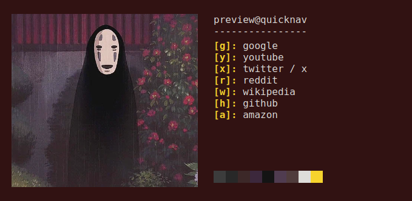
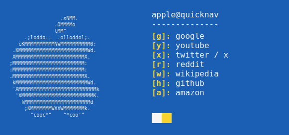

# QuickNav

## About

Quicknav is a browser extension which allows you to very quickly navigate to new pages.

## Documentation

### How To

1. Go to the menu bar and press the QuickNav icon. Then, press 'Options'
2. On the shortcuts page, you can add keyboard shortcuts, names, and urls. For example, 'y, youtube, youtube.com'. Then, when the QuickNav menu is open, pressing the 'y' key will send you to 'youtube.com'. Be sure not to use the same keyboard shortcut for two entries.
3. On the customize page, you can add an image/gif or text/ASCII art. You can also change the background, text, and secondary colors. You can also change the username shown in the QuickNav menu. Currently, the shortcut cannot be changed from 'Alt+Z'. Be sure to press the save button.
4. Close the options page and press 'Alt+Z', or the custom shortcut, to open the QuickNav menu. Certain pages, like the default new tab page, do not allow for the menu to be opened. Also, you may need to refresh to page after a save for the functionality to work.

### File Structure

browsers/
firefox/
- icons/
-    contains the icon in various sizes
- options/
-    the options menu, along with js files for each subpage
- popup/
-    the popup when the icon is clicked on the browser menu
- scripts/
-    background waits for key presses
-    color extracts colors from image
-    constants holds default values
-    content is the actual quicknav menu
- manifest.json

### Note on Browsers

This extension is made with cross browser support in mind. All the code should be compatible across browswers, except for the manifest files.
The manifest files can be found in the /browsers directory. 

## Examples

## Support

You can support this project and others with a donation on PayPal [[Link]](https://paypal.me/opkarghadu)